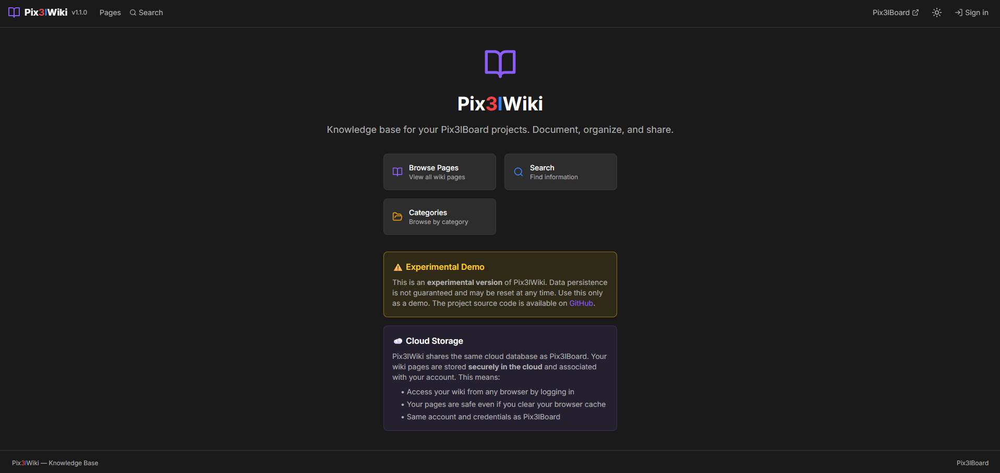

# Pix3lWiki

**Document, organize, and share knowledge for your Pix3lBoard projects.**

Pix3lWiki is a wiki companion app that integrates with [Pix3lBoard](https://board.pix3ltools.com). It shares the same database and authentication, allowing you to create rich documentation linked to your boards and cards.

> **Note**: This is an experimental app. Data persistence is not guaranteed and may be reset at any time.

## Screenshot



## Features

### Core Functionality
- **Wiki Pages**: Create and edit pages with full Markdown support (GFM, syntax highlighting, tables)
- **Categories**: Organize pages with color-coded categories
- **Tags**: Tag pages for flexible cross-category organization
- **Full-Text Search**: Search across titles and content with category filters
- **Version History**: Every edit creates a new version with optional change summary and restore capability
- **Live Preview Editor**: Split-pane editor with toolbar and real-time Markdown preview
- **Table of Contents**: Auto-generated TOC from page headings
- **Public/Draft/Archived**: Control page visibility with status

### Pix3lBoard Integration
- **Shared Database**: Same Turso database and user accounts as Pix3lBoard
- **Cross-App Auth**: Same JWT tokens work across both apps
- **Board Links**: Link wiki pages to boards and cards
- **Context Bridge**: Navigate from Pix3lBoard with `?board=123&card=456` parameters
- **Back Links**: Quick navigation back to the originating board/card

### Admin Panel
- **Page Management**: View, edit, and delete all pages
- **Category Management**: Create, edit, and delete categories with color picker
- **Backup & Restore**: Export all wiki data as JSON, export pages as Markdown ZIP, or restore from a previously exported JSON backup (atomic all-or-nothing operation)

### User Experience
- **Dark Mode**: Eye-friendly dark theme with light mode toggle
- **Responsive Design**: Works on desktop, tablet, and mobile
- **Consistent Design**: Same design system as Pix3lBoard (colors, components, typography)
- **Toast Notifications**: Clear feedback for all actions
- **Protected Routes**: Middleware redirects unauthenticated users

## Tech Stack

- **Framework**: Next.js 14 (App Router)
- **Language**: TypeScript (strict mode)
- **Database**: Turso (libSQL/SQLite) - shared with Pix3lBoard
- **Authentication**: Custom JWT with bcryptjs (same as Pix3lBoard)
- **Validation**: Zod schema validation
- **Styling**: Tailwind CSS with custom CSS variables
- **Markdown**: react-markdown + remark-gfm + rehype-highlight + rehype-slug
- **Icons**: Lucide React
- **ID Generation**: nanoid

## Getting Started

### Prerequisites
- Node.js 20+
- npm
- A running Pix3lBoard instance (same Turso database)

### Installation

1. Clone the repository:
```bash
git clone https://github.com/Pix3ltools-lab/pix3lwiki.git
cd pix3lwiki
```

2. Install dependencies:
```bash
npm install
```

3. Set up environment variables:
```bash
cp .env.example .env
```

Edit `.env` with your credentials (same as Pix3lBoard):
```env
# Turso Database (same as Pix3lBoard)
TURSO_DATABASE_URL="libsql://your-database.turso.io"
TURSO_AUTH_TOKEN="your-auth-token"

# JWT Secret (same as Pix3lBoard for token compatibility)
JWT_SECRET="your-jwt-secret"

# Pix3lBoard URL
NEXT_PUBLIC_PIX3LBOARD_URL=https://board.pix3ltools.com
```

4. Initialize the wiki tables:
```bash
npm run db:setup
```

5. Run the development server:
```bash
npm run dev
```

6. Open [http://localhost:3001](http://localhost:3001) in your browser

### Build for Production

```bash
npm run build
npm run start
```

### Deploy to Vercel

1. Push your code to GitHub
2. Import the project in Vercel
3. Add environment variables:
   - `TURSO_DATABASE_URL`
   - `TURSO_AUTH_TOKEN`
   - `JWT_SECRET`
   - `NEXT_PUBLIC_PIX3LBOARD_URL`
4. Deploy

### Deploy with Docker

Pre-built Docker images are available from the [pix3ltools-deploy](https://github.com/Pix3ltools-lab/pix3ltools-deploy) repository. It provides a `docker-compose.yml` that runs Pix3lBoard, Pix3lWiki, and a local SQLite database — no cloud services required.

```bash
git clone https://github.com/Pix3ltools-lab/pix3ltools-deploy.git
cd pix3ltools-deploy
cp .env.example .env   # edit and set JWT_SECRET
docker compose up -d
```

See the [deploy repo README](https://github.com/Pix3ltools-lab/pix3ltools-deploy#readme) for full setup instructions.

## Project Structure

```
pix3lwiki/
├── app/                          # Next.js App Router pages
│   ├── api/                      # API routes
│   │   ├── admin/                # Admin API (export JSON/MD, restore)
│   │   ├── auth/                 # Authentication (login, me, logout)
│   │   └── wiki/                 # Wiki API
│   │       ├── pages/            # Pages CRUD + versions
│   │       ├── categories/       # Categories CRUD
│   │       ├── search/           # Full-text search
│   │       └── links/            # Pix3lBoard links
│   ├── admin/                    # Admin panel
│   ├── auth/login/               # Login page
│   ├── wiki/
│   │   ├── [slug]/               # Page view + edit
│   │   ├── categories/[cat]/     # Category listing
│   │   ├── new/                  # New page
│   │   └── search/               # Search
│   ├── page.tsx                  # Homepage
│   ├── layout.tsx                # Root layout
│   └── globals.css               # Global styles + prose-wiki
├── components/
│   ├── admin/                    # PageTable, CategoryManager, Export/Restore buttons
│   ├── layout/                   # Header, Sidebar, Footer, ThemeToggle
│   ├── providers/                # AppProvider
│   ├── ui/                       # Button, Input, Modal, Spinner, Toast, etc.
│   └── wiki/                     # MarkdownRenderer, WikiEditor, WikiCard, etc.
├── e2e/                          # Playwright E2E tests
│   ├── auth.setup.ts             # Login + save storage state
│   ├── fixtures.ts               # Shared test helpers
│   ├── auth.spec.ts              # Authentication tests
│   ├── wiki.spec.ts              # Wiki pages tests
│   ├── category.spec.ts          # Category management tests
│   ├── search.spec.ts            # Search tests
│   └── api.spec.ts               # API endpoint tests
├── lib/
│   ├── auth/                     # JWT auth + middleware helpers
│   ├── bridge/                   # Pix3lBoard integration bridge
│   ├── context/                  # AuthContext, UIContext
│   ├── db/                       # Turso client + setup
│   ├── utils/                    # ID generation, slugify
│   ├── validation/               # Zod schemas + unit tests
│   └── constants.ts              # App constants
├── scripts/
│   └── db-init.sh                # CI database setup + test user
├── types/                        # TypeScript types
├── middleware.ts                  # Route protection
├── playwright.config.ts          # Playwright configuration
└── vitest.config.ts              # Vitest configuration
```

## Database Schema

Wiki-specific tables (in the shared Turso database):

```sql
wiki_categories    -- Categories with name, slug, color, sort_order
wiki_pages         -- Pages with title, slug, content, category, tags, status, version
wiki_versions      -- Version history per page with change summary
pix3lboard_links   -- Cross-references to boards/cards/workspaces
```

## Testing

### Unit Tests (Vitest)

28 tests covering all Zod validation schemas:

```bash
npm run test:unit
```

### E2E Tests (Playwright)

27 tests across 5 suites covering auth, wiki pages, categories, search, and API:

```bash
# Run all E2E tests (needs running dev server + database)
npm run test:e2e

# Interactive UI mode
npm run test:e2e:ui

# Headed browser (visible)
npm run test:e2e:headed

# Slow motion for demos
SLOW_MO=500 npm run test:e2e:headed
```

E2E tests require environment variables `E2E_USER_EMAIL` and `E2E_USER_PASSWORD` pointing to an existing user. See `scripts/db-init.sh` for automated database + test user setup.

### CI/CD

GitHub Actions runs on every push and PR to `main`:

- **Job 1: Lint & Type-check** — `npm run lint` + `npm run type-check` + `npm run build`
- **Job 2: E2E Tests** (depends on Job 1) — spins up a libSQL server, initializes the database, runs the full Playwright suite

Playwright HTML report is uploaded as artifact on every run.

## Available Scripts

- `npm run dev` - Start development server (port 3001)
- `npm run build` - Build for production
- `npm run start` - Start production server
- `npm run lint` - Run ESLint
- `npm run type-check` - Run TypeScript compiler
- `npm run db:setup` - Initialize wiki database tables
- `npm run test:unit` - Run Vitest unit tests
- `npm run test:e2e` - Run Playwright E2E tests
- `npm run test:e2e:ui` - Open Playwright interactive UI
- `npm run test:e2e:headed` - Run E2E tests with visible browser

## Security

- **Authentication**: JWT tokens stored in HttpOnly cookies with SameSite protection
- **Password Security**: bcrypt hashing with 12 salt rounds (via Pix3lBoard)
- **Input Validation**: Zod schema validation on all API inputs, including content length limits
- **Security Headers**: CSP, HSTS, X-Frame-Options, X-Content-Type-Options
- **SQL Injection Prevention**: Parameterized queries throughout
- **Route Protection**: Middleware redirects for authenticated-only pages
- **Authorization**: Only authors and admins can edit or delete pages
- **Rate Limiting**: Login endpoint limited to 5 attempts per 15 minutes (DB-persisted, works on serverless)
- **Audit Logging**: Admin export and restore operations are logged server-side (who, when, record counts)
- **Restore Confirmation**: Database restore requires an explicit `"DELETE ALL DATA"` field in the request body
- **Docker**: Container runs as non-root user (`node`, uid 1000)

## Logging

All API routes use [Pino](https://getpino.io/) for structured JSON logging. Log level is configurable via the `LOG_LEVEL` environment variable (defaults to `info`). Supported levels: `fatal`, `error`, `warn`, `info`, `debug`, `trace`.

```bash
# Enable debug logging
LOG_LEVEL=debug npm run start

# Pretty-printed logs in development
npm run dev:pretty
```

- **Vercel**: JSON logs appear in the Function Logs dashboard
- **Docker**: `docker compose logs -f pix3lwiki`
- **Local dev**: `npm run dev:pretty` for human-readable colored output

## Contributing

See [CONTRIBUTING.md](CONTRIBUTING.md) for guidelines.

## License

MIT License - see [LICENSE](LICENSE) for details.

## Acknowledgments

Built with:
- [Next.js](https://nextjs.org/)
- [Turso](https://turso.tech/)
- [Tailwind CSS](https://tailwindcss.com/)
- [react-markdown](https://github.com/remarkjs/react-markdown)
- [Lucide Icons](https://lucide.dev/)

---

**Part of [Pix3lTools](https://x.com/pix3ltools)**

Made with the help of Claude Code
